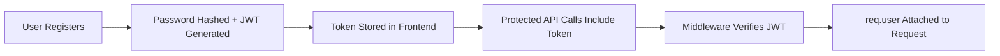

# Week 11: Jamii Link KE - Database & Authentication

## Author
- **Name:** Amos Kimiti
- **GitHub:** [@Kimiti4](https://github.com/Kimiti4)
- **Date:** May 1, 2026

## Project Description
Jamii Link KE is a unified community platform for Kenya that connects neighborhoods through Mtaani alerts, skill swaps, farm markets, and gig opportunities. Week 11 adds persistent data storage with MongoDB Atlas and secure user authentication with JWT tokens, enabling users to create accounts, manage their posts, and engage with the community securely.

## Technologies Used
- HTML5
- CSS3
- JavaScript (ES6+)
- Node.js
- Express.js
- MongoDB Atlas
- Mongoose ODM
- JWT (JSON Web Tokens)
- bcryptjs for password hashing
- dotenv for environment configuration

## Features
- User registration and login with JWT authentication
- Password hashing with bcrypt for security
- Protected API routes with role-based authorization
- Posts linked to authenticated users (author relationship)
- Nested comments with user attribution
- Advanced post filtering by category, location, price, and search
- Text search across post titles, content, and tags
- Geospatial queries for location-based filtering
- Pagination support for efficient data loading
- Frontend integration with JWT token management
- Daily challenges completed (MongoDB connection, User registration, Protected routes, User profiles, Authorization)

## How to Run
1. Clone this repository
   ```bash
   git clone https://github.com/Kimiti4/iyf-s10-week-11-Kimiti4.git
   cd iyf-s10-week-11-Kimiti4
   ```

2. Install dependencies
   ```bash
   npm install
   ```

3. Setup environment variables
   ```bash
   cp .env.example .env
   # Edit .env with your MongoDB Atlas connection string and JWT secret
   ```

4. Start the development server
   ```bash
   npm run dev
   ```

5. Visit the application
   - Frontend: http://localhost:3000
   - API Health: http://localhost:3000/api/health
   - API Base: http://localhost:3000/api

## Lessons Learned
- Implemented MongoDB schema design with Mongoose, including relationships between Users, Posts, and Comments
- Learned JWT authentication flow: token generation, verification, and middleware protection
- Understood password security best practices using bcrypt hashing with salt rounds
- Implemented authorization patterns for resource ownership (users can only edit/delete their own content)
- Created nested API routes for comments under posts with proper parameter merging
- Configured text indexes and geospatial indexes for advanced querying capabilities
- Integrated frontend localStorage for JWT token persistence and automatic auth headers
- Practiced async/await patterns with error handling using custom asyncHandler utility

## Challenges Faced
- **Challenge 1**: Setting up MongoDB Atlas connection string and configuring proper authentication
  - **Solution**: Created detailed .env.example template and database.js connection handler with error logging
  
- **Challenge 2**: Implementing JWT middleware that properly extracts and verifies tokens
  - **Solution**: Built protect middleware that checks Authorization header, verifies JWT signature, and attaches user to request object
  
- **Challenge 3**: Ensuring posts are linked to authenticated users instead of anonymous authors
  - **Solution**: Updated posts controller to use req.user._id from JWT middleware instead of request body author field
  
- **Challenge 4**: Managing nested comment routes under posts with proper authorization
  - **Solution**: Used express.Router({ mergeParams: true }) to access postId from parent route and implemented ownership checks
  
- **Challenge 5**: Migrating from in-memory store to MongoDB while maintaining API compatibility
  - **Solution**: Rewrote controllers to use Mongoose models with populate() for relationships, kept same response structure

## Screenshots (optional)


## Live Demo (if deployed)
[View Live Demo](https://your-deployed-url.com)

---

## 🎯 Week 11 Deliverables
✅ MongoDB Atlas integration with Mongoose  
✅ User registration & login with JWT authentication  
✅ Protected routes with role-based authorization  
✅ Posts linked to users (author relationship)  
✅ Comments with nested population  
✅ All daily challenges completed  

## 🚀 Quick Start
```bash
# 1. Clone repo
git clone https://github.com/Kimiti4/iyf-s10-week-11-Kimiti4.git
cd iyf-s10-week-11-Kimiti4

# 2. Install dependencies
npm install

# 3. Setup environment
cp .env.example .env
# Edit .env with your MongoDB Atlas connection string & JWT secret

# 4. Start server
npm run dev

# 5. Visit app
# → Frontend: http://localhost:3000
# → API Docs: http://localhost:3000/api/health
```

## 🔐 Authentication Flow


## 📡 API Endpoints (Week 11)

### Auth
```http
POST /api/auth/register  # { username, email, password }
POST /api/auth/login     # { email, password } → { token, user }
GET  /api/auth/me        # Protected: Get current user
PUT  /api/auth/me        # Protected: Update profile
```

### Posts (with Authorization)
```http
GET    /api/posts                    # Public: List with filters
GET    /api/posts/:id                # Public: Single post + comments
POST   /api/posts                    # Protected: Create (auth required)
PUT    /api/posts/:id                # Protected: Update (owner only)
DELETE /api/posts/:id                # Protected: Delete (owner/admin)
PATCH  /api/posts/:id/engage?type=like
```

### Comments (Nested)
```http
GET    /api/posts/:postId/comments          # Public
POST   /api/posts/:postId/comments          # Protected
DELETE /api/posts/:postId/comments/:id      # Protected (owner/admin)
```

### Utilities
```http
GET /api/health           # Server + DB status
GET /api/market/prices    # Farm price comparison (demo data)
GET /api/locations        # Kenya counties/settlements
```

## 🗄️ Database Schema Overview

### User
```javascript
{
  _id: ObjectId,
  username: String,      // unique, indexed
  email: String,         // unique, lowercase
  password: String,      // hashed, never returned
  role: 'user'|'admin',
  profile: { bio, location, skills },
  createdAt, updatedAt
}
```

### Post
```javascript
{
  _id: ObjectId,
  title: String,         // indexed
  content: String,       // text indexed
  author: ObjectId → User,
  category: 'mtaani'|'skill'|'farm'|'gig'|'alert',
  location: { county, settlement, coordinates },
  metadata: { crop, price, urgency, ... }, // flexible
  likes, upvotes, views,
  tags: [String],
  comments: [ObjectId → Comment],
  published: Boolean,
  createdAt, updatedAt
}
```

### Comment
```javascript
{
  _id: ObjectId,
  content: String,
  author: ObjectId → User,
  post: ObjectId → Post,
  createdAt, updatedAt
}
```

## ✅ Week 11 Checklist
- [x] Set up MongoDB Atlas cluster
- [x] Connected Express to MongoDB via Mongoose
- [x] Created Mongoose schemas with validation
- [x] Implemented text search & geospatial indexes
- [x] Built full CRUD with pagination & filtering
- [x] Created User model with bcrypt password hashing
- [x] Implemented registration & login with JWT
- [x] Created auth middleware (protect, restrictTo)
- [x] Protected post routes with ownership checks
- [x] Linked posts to users via ObjectId references
- [x] Implemented nested comments with population
- [x] Completed all 5 daily challenges
- [x] Updated frontend to handle JWT auth flow

## 🔧 Testing the API
```bash
# Health check
curl http://localhost:3000/api/health

# Register user
curl -X POST http://localhost:3000/api/auth/register \
  -H "Content-Type: application/json" \
  -d '{"username":"testuser","email":"test@jamii.co.ke","password":"secure123"}'

# Login & get token
curl -X POST http://localhost:3000/api/auth/login \
  -H "Content-Type: application/json" \
  -d '{"email":"test@jamii.co.ke","password":"secure123"}'

# Use token to create post
curl -X POST http://localhost:3000/api/posts \
  -H "Content-Type: application/json" \
  -H "Authorization: Bearer YOUR_TOKEN_HERE" \
  -d '{"title":"My First Post","content":"Hello Jamii Link!","category":"mtaani"}'

# Run daily challenges test
node daily-challenges.test.js
```

## 🌍 Why This Matters for Kenya
1. **Data Persistence**: Posts survive server restarts → reliable community memory
2. **User Accounts**: Build reputation, track contributions, enable moderation
3. **Authorization**: Farmers own their listings; admins can moderate content
4. **Scalable Foundation**: Ready for M-Pesa integration, SMS alerts, mobile app
5. **Real-World Skills**: MongoDB, JWT, Mongoose = industry-standard backend stack

## 🚀 Next Steps (Week 12+)
- [ ] Add M-Pesa integration for farm transactions
- [ ] Implement SMS notifications via Twilio/Africa's Talking
- [ ] Add image upload for post attachments
- [ ] Build admin dashboard for content moderation
- [ ] Deploy to Render.com with MongoDB Atlas

---

<sub>Built with ❤️ for IYF Summer 2026 • [GitHub](https://github.com/Kimiti4/iyf-s10-week-11-Kimiti4)</sub>
